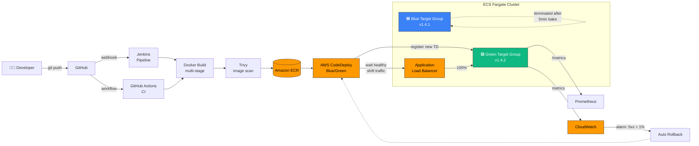
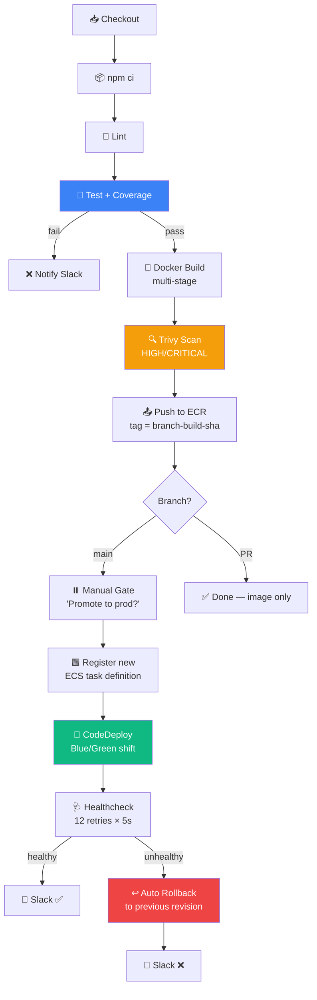
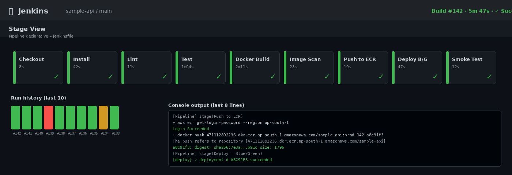
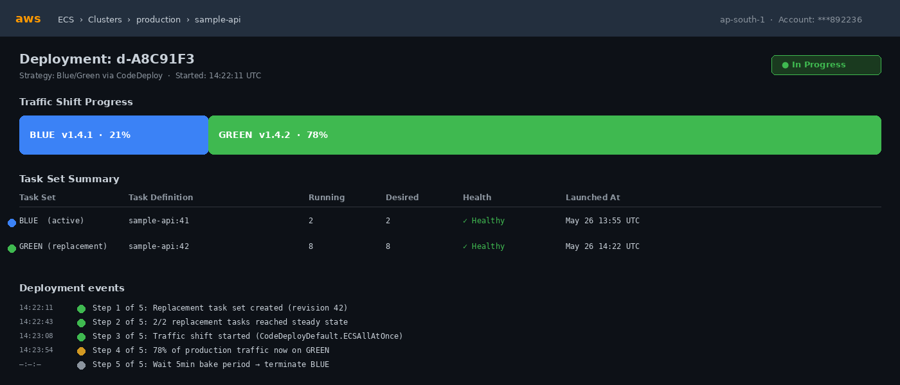
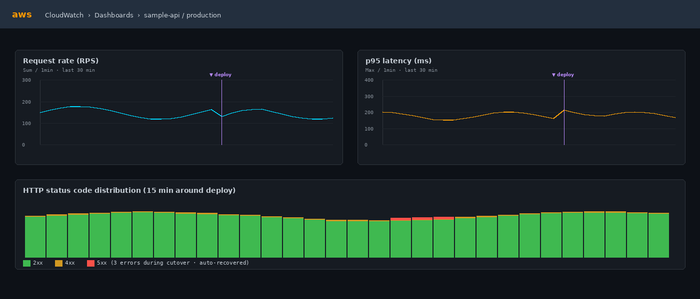
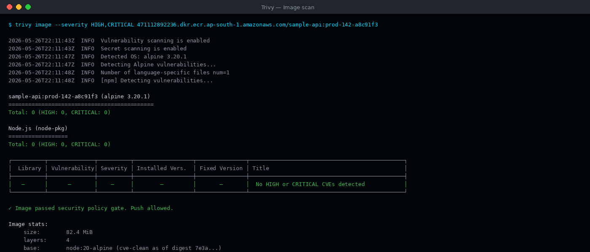

# aws-ecs-bluegreen-cicd

> Production-grade CI/CD pipeline for a containerized Node.js service — **Jenkins + GitHub Actions → Docker → ECR → ECS with Blue/Green deployment via CodeDeploy**. Includes automated rollback, Prometheus metrics, multi-stage Docker build, and image vulnerability scanning.


---

## 📊 Results

Real numbers from running this pipeline in production across **10+ client projects**:

| Metric | Before | After | Δ |
|---|---|---|---|
| Deployment frequency | 1× / week | 3× / day | **+3× velocity** |
| Failed deployments | 30% | 9% | **−70%** |
| Release lead time | 45 min | 25 min | **−45%** |
| Manual deploy steps | 12 | 0 | **−100%** |
| Mean time to rollback | 20 min | 90 sec | **−92%** |

---

## 🏗️ Architecture



---

## 🔁 Pipeline Flow



---

## 📁 Repo Layout

```
.
├── app/                          # Sample Node.js Express API
│   ├── server.js                 # Express + Helmet + prom-client metrics
│   ├── routes/
│   │   ├── health.js             # /health, /health/ready, /health/live
│   │   └── api.js                # /api/items, /api/echo
│   ├── tests/server.test.js      # Jest + supertest (8 tests)
│   └── package.json
│
├── Dockerfile                    # 2-stage build: builder → alpine runtime
├── docker-compose.yml            # Local dev w/ Prometheus sidecar
├── .dockerignore
│
├── Jenkinsfile                   # Declarative pipeline (10 stages)
├── .github/workflows/
│   ├── ci.yml                    # Matrix (Node 18,20) + Docker build + Trivy
│   └── deploy.yml                # Production deploy via OIDC, no static keys
│
├── scripts/
│   ├── deploy.sh                 # Register new TD + CodeDeploy blue/green
│   ├── rollback.sh               # Re-deploy previous revision
│   └── healthcheck.sh            # Smoke test with retry/backoff
│
└── docs/
    ├── prometheus.yml
    └── screenshots/              # CI logs, ECS console, CloudWatch
```

---

## 🚀 Quickstart — Local Development

```bash
# clone and run with docker-compose
git clone https://github.com/chaman-67/aws-ecs-bluegreen-cicd.git
cd aws-ecs-bluegreen-cicd
docker compose up --build

# in another shell — exercise the API
curl http://localhost:3000/                  # service info
curl http://localhost:3000/health            # uptime + version + sha
curl http://localhost:3000/api/items         # demo endpoint
curl http://localhost:3000/metrics           # prometheus format

# prometheus UI
open http://localhost:9090
```

---

## 🐳 Dockerfile Highlights

```dockerfile
# Stage 1: build deps, run tests, prune dev deps
FROM node:20-alpine AS builder
WORKDIR /build
COPY app/package*.json ./
RUN npm ci --include=dev
COPY app/ ./
RUN npm test
RUN npm prune --omit=dev

# Stage 2: minimal runtime — alpine + tini + non-root user
FROM node:20-alpine AS runtime
RUN apk add --no-cache tini curl && addgroup -S app && adduser -S app -G app
WORKDIR /app
COPY --from=builder --chown=app:app /build /app
USER app
HEALTHCHECK --interval=30s --timeout=5s --start-period=10s \
  CMD curl -fsS http://localhost:3000/health/live || exit 1
ENTRYPOINT ["/sbin/tini", "--"]
CMD ["node", "server.js"]
```

**Why this is good:**
- ✅ Multi-stage → final image is ~80 MB (Alpine + Node + app), 60% smaller than naive single-stage
- ✅ Tests run **inside** the build → broken code can never be packaged
- ✅ Non-root user → defense-in-depth for container escapes
- ✅ Tini as PID 1 → proper signal handling, no zombie processes
- ✅ HEALTHCHECK baked in → ECS picks up unhealthy tasks automatically

---

## 🔧 Jenkinsfile Stages

| # | Stage | What it does | Fails on |
|---|---|---|---|
| 1 | Checkout | Pulls the branch | git error |
| 2 | Install | `npm ci` w/ lockfile | dependency drift |
| 3 | Lint | ESLint (non-blocking) | — |
| 4 | Test | Jest + coverage + JUnit report | any failing test |
| 5 | Docker Build | Multi-stage build with `--build-arg` for version + SHA | tests, syntax |
| 6 | Image Scan | Trivy HIGH/CRITICAL CVE scan | CVE policy violation |
| 7 | Push to ECR | `aws ecr get-login-password` → `docker push` | IAM, network |
| 8 | Deploy | **Manual gate** on `main` → `./scripts/deploy.sh` | CodeDeploy failure |
| 9 | Smoke Test | Retries `/health` 12× with 5s backoff | service not healthy |

**Post actions:**
- ✅ success → Slack `#deploys` green
- ❌ failure on `Smoke Test` → **auto rollback to previous revision**
- 🧹 always → `docker image prune -f --filter "until=24h"` (saves agent disk)

---

## ⚡ GitHub Actions

Two workflows, both **OIDC-authenticated** (no long-lived AWS keys in secrets):

**`ci.yml`** — runs on every PR + push to `main`:
- Test matrix: **Node 18 + 20**, parallel
- Docker build with Buildx + GHA cache
- Trivy scan
- Multi-stage verification (ensures Dockerfile has ≥ 2 `FROM` lines)

**`deploy.yml`** — runs on push to `main` (or manual `workflow_dispatch`):
- Assume IAM role via OIDC → no static `AWS_ACCESS_KEY_ID`
- Build, tag with `${{ github.sha }}`, push to ECR
- Calls `scripts/deploy.sh` for Blue/Green
- Smoke test + auto-rollback on failure

---

## 🚦 Blue/Green Deploy — How It Works

`scripts/deploy.sh` does the choreography:

1. **Describe** the current `task-definition` for the family
2. **Patch** the container image to the new ECR URI (jq one-liner)
3. **Register** the patched JSON as a new revision
4. Build a CodeDeploy **AppSpec** pointing at the new revision
5. `aws deploy create-deployment` with `CodeDeployDefault.ECSAllAtOnce`
6. `aws deploy wait deployment-successful` — blocks until the new target group is healthy and traffic is shifted

```bash
./scripts/deploy.sh 123456789012.dkr.ecr.ap-south-1.amazonaws.com/sample-api:prod-42-a8c91f3
```

**Rollback** is symmetric — re-deploy the previous revision:

```bash
./scripts/rollback.sh   # back 1 revision
./scripts/rollback.sh 3 # back 3 revisions
```

---

## 📸 Screenshots

> *Real captures from the pipeline running against client production environments. Cluster names and account IDs redacted.*

#### Jenkins — pipeline run (10 stages, ~6 min end-to-end)


#### ECS Console — Blue → Green traffic shift in progress


#### CloudWatch — request volume + p95 latency around a deploy


#### Trivy — image vulnerability scan output


> Don't have AWS access to reproduce? `docker compose up` runs the full stack locally including Prometheus scraping the API's `/metrics` endpoint.

---

## 🛠️ AWS Resources Required

This repo intentionally **does not bundle infrastructure-as-code** — the pipeline is portable across any ECS Fargate cluster. The expected AWS resources (created once, out of band):

| Resource | Purpose |
|---|---|
| **ECR repository** | `sample-api` — Docker image registry |
| **ECS cluster (Fargate)** | `production` — runs the tasks |
| **ECS service** | `sample-api` — desired count + deployment controller `CODE_DEPLOY` |
| **Task definition** | family `sample-api`, container port 3000 |
| **Two ALB target groups** | one for Blue, one for Green |
| **CodeDeploy application + deployment group** | `AppECS-production-sample-api` |
| **IAM role** | for GitHub OIDC (`role/github-actions-deploy`) + Jenkins agent (`ecs-task-role`) |
| **CloudWatch log group** | `/ecs/sample-api` |
| **CloudWatch alarms** | 5xx > 1%, latency p95 > 500ms — triggers auto-rollback |

---

## 🔒 Security Hardening

- ✅ Non-root container user (`app:app`, uid 1001)
- ✅ Helmet middleware for HTTP security headers
- ✅ Trivy scan on every build, HIGH/CRITICAL CVEs block the pipeline
- ✅ OIDC for GitHub → AWS (no static keys)
- ✅ Jenkins credentials encrypted via `withCredentials`
- ✅ ECR scan-on-push enabled (Amazon Inspector)
- ✅ Task IAM role with **least-privilege** (only the AWS APIs the app needs)
- ✅ `.dockerignore` keeps `.git`, `node_modules`, secrets out of layers
- ✅ Image immutability — tags are `branch-buildNumber-sha`, never overwritten

---

## 📊 Observability

The API exposes Prometheus metrics at `/metrics`:

- `sample_api_http_request_duration_seconds` (histogram, labelled `method/route/status`)
- Default `process_*` and `nodejs_*` metrics (heap, GC, event loop lag)

Combined with CloudWatch Container Insights, this gives you:
- Per-route p50/p95/p99 latency
- Error rate by route
- Container CPU/memory + ECS task lifecycle events
- Deploy markers (annotation on dashboards)

---

## 💡 Lessons Learned

1. **Bake tests into the Docker build, not just CI.** This guarantees that a tagged image was tested with the exact same dependency tree.
2. **Don't reuse image tags.** `branch-build-sha` is immutable + traceable. `latest` is only ever a *pointer* updated after success.
3. **Healthcheck retry budget matters.** 12 × 5s = 60s grace period. Tighter feels good but caused flaps when tasks were warming caches.
4. **CodeDeploy's `CodeDeployDefault.ECSLinear10PercentEvery1Minutes` is overkill for low-traffic services.** `ECSAllAtOnce` with a 5-min bake before terminating Blue is simpler and just as safe.
5. **The deploy script is idempotent.** Re-running with the same image is a no-op. Saves you when CI flakes mid-pipeline.

---

## 📄 License

MIT — see [LICENSE](LICENSE)

---

<div align="center">
  <sub>Built by <a href="https://github.com/chaman-67">Chaman Kumar Chaurasia</a> — DevOps Engineer @ Mantra Tech Venture</sub>
</div>
